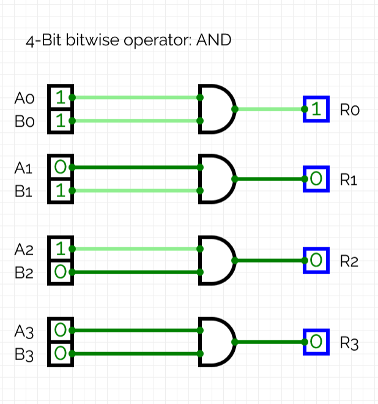
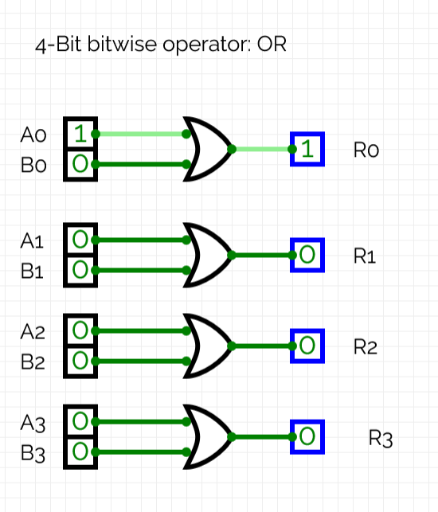

# 4 Bit ALU (arithmetic logic unit)
hallo, its time to make a 4-Bit ALU :D

## Breaking down the ALU 
An ALU has 3 major components to it. The input, multiplexer, and output. To understand the functionality of the ALU to the trasitor level lets first look at a 1-bit ALU. 

### 1-bit ALU 
There are 4 main inputs, 4 gates and a multiplexer that are important. 
<p align = "center">
  
</p>

#### Inputs
The first two inputs are the user number inputs *(X, Y)*, these are the numbers that will have the operations conducted apon 

The last two inputs are also input by the user but processed by the computer to be the operand that will be executed on the input bits X and Y. These are called the S0 and S1 inputs. These decide the mathematical operations (AND, OR, XOR, NOT). 

The 4 gates (AND, OR, XOR, NOT) do the calculations for the two input bits (X, Y). The gates compute all the possible results. 

#### Multiplexer:
The Multiplexer (or MUX) simply selects which of the results from the calculations outside the MUX will be output to the user based on the S1 and S2 input for mathematical operation. This selected value by the MUX will become the output (Y). 
#### Gates
The gates outside the multiplexer perform different logical operatiosn on A and B simultaneously. Their outputs are connected to the MUX, which selects one results accoridng to the control inputs (S0 and S1)

## 4-bit ALU 
Now that an understanding of the relative functionality of a 1-bit ALU is established, its time to diverge into understanding the building and functionality of 4-bit ALU. For this specific ALU design, there are two logical bitwise operators (AND, OR), and two arithemtic operators (Addition and Substraction).

## Arithmetic operations

### 4-Bit adder (Arithmetic operation of addition)
An adder adds elements bitwise, however the carry function that can be seen in decimal addition is applied here. The sum and difference are two outputs of each operation. 

Building the 4-bit adder is a combination of 1 half adder, and 3 full adders.

 (Built using Circuit verse)

from the above example, you can see that the design is able to execute binary addition. 
0110 (6) + 1000 (8) = 1110 (14) 

### 4-bit Subtractor (Arithmetic operation of subtraction)
Building the 4-bit subtractor, it was a combination of 1 half subtractor, and 3 full subtractors. 
 (Built using Circuit verse)

From the above diagram, you can see the subtractor is working. The numbers:
1111 (15) - 0101 (5) = 1010 (10)

## Bitwise operations: Logical operations
The rule for bitwise operations would be 

``` md 
Every bit of A operates with the corresponding bit of B
```
so for a 4-bit input. The pairs of A and B (A0 B0, A1 B1, A2 B2, A3 B3) 

Each pair will go through the same gate.


### 4-bit AND operator 
For this bitwise operation, the boolean operation will be: 

```md 
R = A AND B
```


### 4-bit OR operator 
The OR bitwise operator will have the boolean operations: 

```md 
R = A OR B
```

