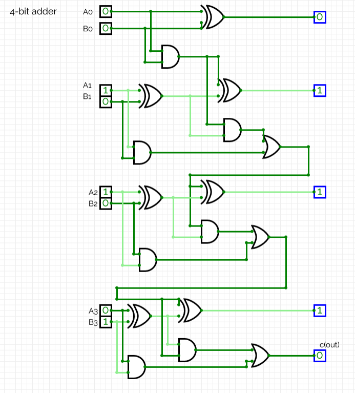
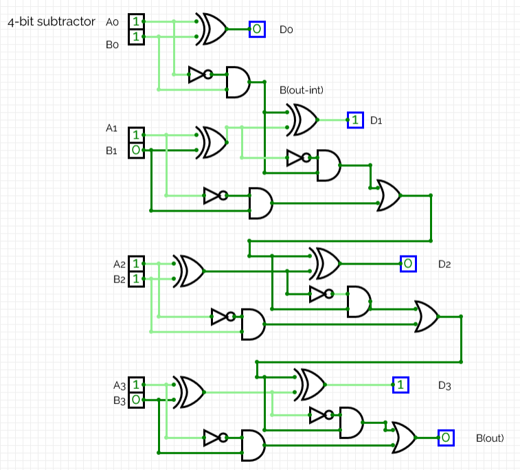

# 4 Bit ALU (Arithmetic Logic Unit)

hallo, its time to make a **4-Bit ALU** :D

## Breaking down an ALU

An ALU has **3 major components**:

- Inputs  
- Multiplexer  
- Output  

To understand the functionality of the ALU down to the transistor level, lets first look at a **1-bit ALU**.

## 1-bit ALU

There are **4 main inputs**, **4 gates**, and a **multiplexer** that are important.

### Inputs

The first two inputs are the **user number inputs** (`X`, `Y`).  
These are the numbers that will have the operations conducted upon them.

The last two inputs are also input by the user but processed by the computer to determine **which operation will be executed** on the input bits.

These are called the **control inputs** (`S0`, `S1`).

These decide the mathematical operations:

- AND  
- OR  
- XOR  
- NOT  

---

### Logic Gates

The **4 gates (AND, OR, XOR, NOT)** perform the calculations for the two input bits.

The gates compute **all the possible results simultaneously**.

Each gate produces an output which is connected to the **multiplexer**.

---

### Multiplexer (MUX)

The **Multiplexer (MUX)** selects which of the results from the calculations outside the MUX will be output.

The selection depends on the **control inputs (`S0`, `S1`)**.

The gates outside the multiplexer perform different logical operations on the inputs simultaneously. Their outputs are connected to the MUX, which selects **one result according to the control inputs**.

This selected value becomes the **final output**.

---

# 4-bit ALU

Now that an understanding of the **relative functionality of a 1-bit ALU** is established, its time to move into understanding the **construction and functionality of a 4-bit ALU**.

For this specific ALU design there are:

### Logical operators

- AND  
- OR  

### Arithmetic operators

- Addition  
- Subtraction  

---

# Arithmetic Operations
## 4-bit Adder  
*(Arithmetic operation of addition)*

An **adder** adds elements **bitwise**. However the **carry function**, similar to decimal addition, is also applied here.

Each stage produces two outputs:

- **Sum**
- **Carry**

### Building the 4-bit adder

Building the 4-bit adder is a combination of:

- **1 Half Adder**
- **3 Full Adders**

*(Built using CircuitVerse)*

From the above example, you can see that the design is able to execute **binary addition**.

0110 (6) + 1000 (8) = 1110 (14) 

## 4-bit Subtractor  
*(Arithmetic operation of subtraction)*

Building the **4-bit subtractor** is done using:

- **1 Half Subtractor**
- **3 Full Subtractors**

*(Built using CircuitVerse)*

From the above diagram, you can see the binary subtractor executing:

1111 (15) - 0101 (5) = 1010 (10)

#### 4-bit AND operator 

#### 4-bit OR operator 
